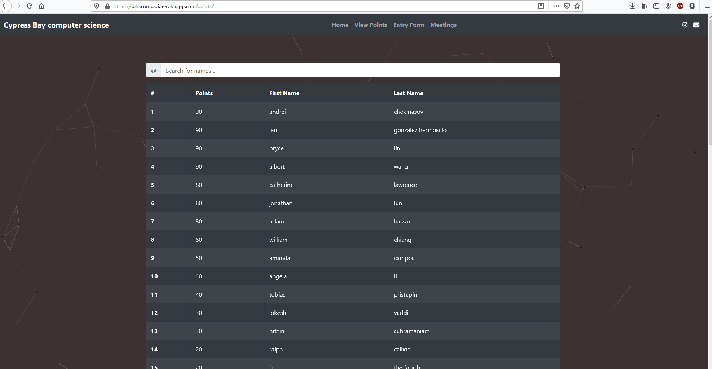

# 📈django-point-system📈
A point system using Django that uses QR codes to track membership and participation.

# Table of contents
- [What is it used for?](#what-is-it-used-for-)
- [Front-end features](#front-end-features)
  * [Particles.js implementation](#particlesjs-implementation)
  * [Chart.js implementation](#chartjs-implementation)
  * [Student information](#student-information)
  * [Entry page](#entry-page)
  * [Meetings](#meetings)
- [Back-end features](#back-end-features)
  * [Meeting Keys](#meeting-keys)
  * [Other fields](#other-fields)
    + [Current Key](#current-key)
    + [Point entry](#point-entry)
    + [Student](#student)
- [Where is the code?](#where-is-the-code-)
- [Links](#links)

# What is it used for?

I created it to make a modern and efficient way to track attendance for clubs. It is currently being used by the computer science, PAWS, and Cybersecurity club at Cypress Bay Highschool

# Front-end features

## Particles.js implementation

Most of the website is fixed upon an interactive [particles.js](https://vincentgarreau.com/particles.js/) background. Because of this, the colors and properties of the particles and the background can be changed quite easily to meet expectations.

## Chart.js implementation

The point section has statistics about each member, as well as total statistics and leaderboards. It is easy to implement more graphics or statistics, but it comes prepackaged with:

* A bar chart activity breakdown of how many points received in each month

* A pie chart of the student's points compared to the total points

* Two donut charts to further visualize the activity of the student

* And finally, a leaderboard of the top 15 students

## Student information

A good amount of features have already been explained above, but there is more as well. The `view points` page is a list of every student and their respective points. Students can be searched for and clicked on to display a deeper breakdown.

## Entry page

The `Entry Form` page is where the magic happens. A QR code will be generated in the admin page, where upon scanning creates a query string to the entry form with the meeting key filled out. All students have to do is input their name and student ID to gain the points for the meeting.

Errors will be created if the data is not valid. Otherwise, a green alert will display that the data went through successfully.

## Meetings

The `meetings` page shows every meeting that has happened with a description of each member that attended.

# Back-end features

## Meeting Keys

The system works by creating meeting keys which link a meeting and the points to each student that attends.

Simply create a meeting key

and distribute it through a query string

The meeting keys are guaranteed to be unique as long as the values aren't changed on creation.

## Other fields

There are three other database objects to be aware of: `Current Key`, `Point entry`, and `Student`.

### Current Key

A very simple object. Starts off as a numeric value(default is 10) and is used by the `Meeting key` to create a unique value every time. The `Meeting key` object hashes the `Current key` and increments it by one to ensure a different value.

Only one `Current key` can be created at a time and one must be created before a meeting key can be created.

### Point entry

A `point entry` is what creates points for each student. It links a student to a point value. When calculating the points for each student, the `point entry` database is queried for a specific student. A `point entry` can be added manually but they are also added automatically from the entry form and `meeting keys`.

### Student

A `student` key is created from the entry form as well, when the student ID isn't recognized. A `student` can be created manually as well. A student is linked to each `meeting` and `point entry`.

# Where is the code?

I do not want to make the code public as of now. However, if you really want a copy of the code, send me an email(which can be found on the footer of any of the examples and most of my projects to begin with) and I'll forward you the code. You can view examples of the system in action at the links section.

# Links

* https://cbhspaws.herokuapp.com
* https://cbhscyber.herokuapp.com/
* https://cbhscompsci.herokuapp.com/
